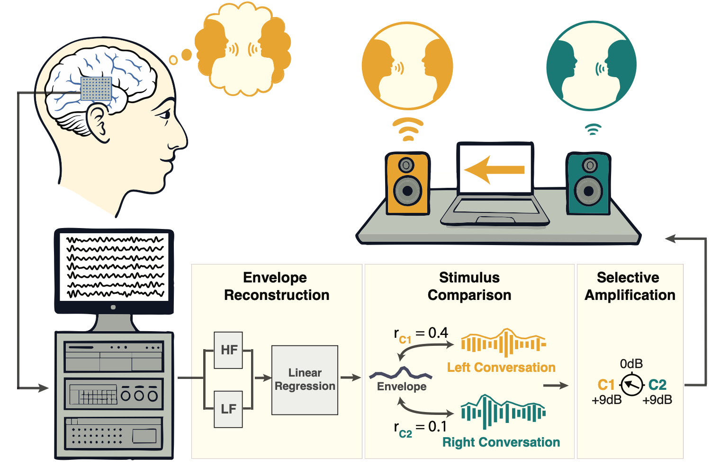

# Real-Time Brain-Controlled Selective Hearing Enhances Speech Perception in Multi-Talker Environments

## 🧠 Introduction

This repository contains the code and experimental framework for the paper:

***Real-time brain-controlled selective hearing enhances speech perception in multi-talker environments*** (in press, *Nature Neuroscience*).

This work presents the first behavioral validation of a real-time, closed-loop, brain-controlled selective hearing system based on Auditory Attention Decoding (AAD). Using high-resolution intracranial EEG (iEEG), we demonstrate that neural signals can be decoded in real time to dynamically enhance the attended talker, leading to measurable perceptual benefits including improved speech intelligibility, reduced listening effort, and increased user preference.

Unlike prior AAD studies that focused primarily on offline decoding performance, this study establishes that brain-controlled hearing systems can deliver robust, real-world perceptual gains in an online, closed-loop setting.

---

## 🖥️ System Framework



*Figure: Overview of the real-time closed-loop brain-controlled selective hearing system. Brain signals of the participats are decoded to estimate auditory attention and dynamically control the selective amplification of the attended conversation.*

---

## 📖 Overview

Understanding speech in noisy environments remains a major challenge for individuals with hearing difficulties. Conventional hearing aids amplify all sounds indiscriminately, limiting their effectiveness in multi-talker scenarios.

This project implements a closed-loop auditory brain-computer interface (BCI) that:

- Records intracranial EEG signals
- Decodes auditory attention in real time
- Dynamically adjusts the target-to-masker ratio (TMR)
- Enhances the attended speech stream
- Evaluates behavioral and subjective benefits

Across multiple experiments, the system:

- Significantly improved speech intelligibility
- Reduced listening effort
- Robustly tracked instructed and self-initiated attention shifts
- Was consistently preferred by participants

This work establishes a critical benchmark for future personalized and intent-driven hearing technologies.

---

## 📁 Repository Structure

```
.
├── model-trainer/
│   └── functions/
│       └── train_model.m
│
├── neural-data/
│   └── XX-000/
│       └── processed/
│           └── B1/
│               ├── out_XX-000_B1_htkraw.mat
│               └── responsive_electrodes.mat
│
├── real-time-decoder/
│   ├── models/
│   │   └── XX000_HighGamma_LowFreq_Model.mat
│   └── run_decoder.m
│
├── stimuli-design/
│   ├── offline/
│   │   └── run_exp_offline_v3.m
│   └── online/
│       └── run_exp_online_v3.m
│
└── README.md
```

---

## ⚙️ Code Structure and Functionality

### 1. `stimuli-design/`

Contains scripts and resources for running experiments.

#### Offline Phase

- A multi-tallker experiment paradigm with two competing conversations
- Participant is cued to follow one of the two conversations
- For obtaining training data for the model, then deployed during the online phase

#### Online Phase

- Runs the real-time closed-loop task
- Paradigm same as the offline phase
- Target-to-masker ratio (TMR) is dynamically controlled using decoded brain signals (participant is unaware)
- Enables adaptive enhancement of the attended speech stream

This module interfaces directly with the real-time decoder to update gains of the conversations based on the decoded neural state of the participant.

---

### 2. `model-trainer/`

Contains scripts for training the auditory attention decoding (AAD) models.

Functionality includes:

- Feature extraction from neural signals
- Envelope reconstruction modeling
- Cross-validation and performance evaluation
- Generation of subject-specific decoding models

Trained models are saved and later deployed in the real-time decoding pipeline.

---

### 3. `real-time-decoder/`

Implements the real-time neural decoding pipeline.

Key responsibilities:

- Reads incoming neural data streams
- Applies trained AAD models
- Estimates attended speech stream
- Computes attention metrics
- Sends decoding results to the online task controller

This module enables closed-loop operation by providing low-latency attention estimates to the stimulus presentation system.

---

### 4. `neural-data/`

Contains preprocessed sample intracranial EEG data and metadata.

Includes:

- Subject-specific recordings
- List of speech responsive electrodes
- Feature extraction outputs
- Processed neural representations used for training and evaluation

Note: Raw data may be restricted due to ethical and privacy considerations.

---

## 🛠️ Requirements

- MATLAB (R2020b or later recommended)
- Signal Processing Toolbox
- Real-time brain data acquisition interface such as TDT or Ripple Neuro Grapevine (for online experiments)

---

## ▶️ Usage

### Running Offline Experiments

```matlab
cd stimuli-design/offline
run_exp_offline_v3
```

### Training AAD Models

```matlab
cd model-trainer/functions
train_model
```

### Starting the Real-Time Decoder

```matlab
cd real-time-decoder
run_decoder
```

### Running Online Closed-Loop Experiments

```matlab
cd stimuli-design/online
run_exp_online_v3
```

Ensure that neural data streams and stimulus presentation modules are synchronized before running online experiments.

---

## 🔁 Reproducibility and Data Availability

Due to human subject and clinical data restrictions, full raw datasets may not be publicly available. Processed data and representative examples are provided where permissible.

Researchers interested in reproducing or extending this work are encouraged to contact the authors.

---

## 📚 Citation

If you use this code or build upon this work, please cite:

```
Choudhari, V. et al. Real-time brain-controlled selective hearing enhances speech perception in multi-talker environments. Nature Neuroscience (in press).
```

BibTeX (to be updated upon publication):

```bibtex
@article{choudhari2026braincontrolled,
  title   = {Real-time brain-controlled selective hearing enhances speech perception in multi-talker environments},
  author  = {Choudhari, Vishal and others},
  journal = {Nature Neuroscience},
  year    = {2026},
  note    = {In press}
}
```